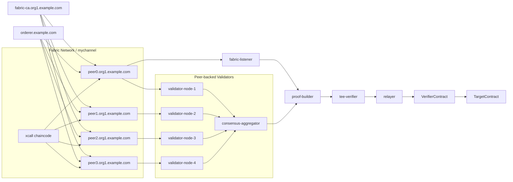

# Cross-Chain Trusted Transport Prototype

## 项目概述

本项目实现了一个面向跨链智能合约调用的可信数据传输原型。当前主线实验场景为：

- 源链：本地 Hyperledger Fabric 网络
- 目标链：本地 Hardhat EVM 测试链
- 链下可信组件：TEE 模拟验证服务
- 源链侧验证层：基于 4 个真实 Fabric peer 的验证节点集合

系统目标是将源链事件转换为统一跨链消息 `XMsg`，并结合事件包含证明、最终性信息、阈值签名证明和 TEE 背书，在目标链上完成可信验证与业务执行。

## 当前架构

当前 Fabric 侧结构如下：

- `fabric-ca.org1.example.com`
  - Fabric CA 服务
- `orderer.example.com`
  - 排序节点
- `peer0.org1.example.com`
- `peer1.org1.example.com`
- `peer2.org1.example.com`
- `peer3.org1.example.com`
  - 4 个 Fabric peer，均加入 `mychannel`
- `validator-node-1`
- `validator-node-2`
- `validator-node-3`
- `validator-node-4`
  - 4 个与 peer 一一绑定的验证节点
- `consensus-aggregator`
  - 聚合 4 个验证节点的签名，生成阈值证明
- `fabric-listener`
  - 监听链码事件并构造 `XMsg`
- `tee-verifier/server.js`
  - 模拟 TEE，对 `XMsg` 和证明材料做链下可信验证
- `VerifierContract.sol`
  - 目标链验证合约
- `TargetContract.sol`
  - 目标链业务合约

验证节点与 peer 的绑定关系为：

- `validator-node-1 -> peer0.org1.example.com`
- `validator-node-2 -> peer1.org1.example.com`
- `validator-node-3 -> peer2.org1.example.com`
- `validator-node-4 -> peer3.org1.example.com`



## 目录说明

- `contracts/`
  - 目标链 Solidity 合约
- `fabric-chaincode/xcall/`
  - Fabric 链码，负责发出 `XCALL` 事件
- `fabric-network/`
  - Fabric 网络配置、连接配置和初始化脚本
- `source-chain/`
  - Fabric 监听器与早期模拟源链脚本
- `proof-builder/`
  - 构造 `XMsg`、事件证明、Merkle 数据
- `consensus-aggregator/`
  - 阈值签名聚合器与验证者集合定义
- `validator-node/`
  - peer-backed validator 服务
- `tee-verifier/`
  - TEE 模拟验证服务
- `relayer/`
  - 将 `XMsg + TEE 背书` 提交到目标链
- `scripts/`
  - 部署、测试、数据集运行脚本
- `test-data/`
  - 功能、安全、性能、真实 Fabric 测试数据
- `runtime/`
  - 运行结果、日志、最新 `XMsg`、测试摘要

## XMsg 处理流程

1. Fabric 链码 `xcall` 发出真实 `XCALL` 事件。
2. `fabric-listener` 捕获事件并提取 `txId`、`blockNumber`、业务负载。
3. `proof-builder` 标准化业务字段并构造 `XMsg`。
4. `consensus-aggregator` 请求 4 个 validator 节点分别签名。
5. 每个 validator 节点先通过自己绑定的 peer 查询 `txId`，确认源链交易存在后再签名。
6. 聚合器收集达到阈值的签名，生成 `consensusProof`。
7. `tee-verifier` 校验 `eventProof`、`finalityInfo`、`consensusProof`，输出 TEE 背书。
8. `relayer` 将 `XMsg + teeSig + teeReport` 提交到目标链。
9. `VerifierContract` 验证通过后调用 `TargetContract`，完成链上业务执行。

## 运行要求

- Windows + PowerShell
- Docker Desktop
- Node.js 20 左右版本
- 本地已安装 npm

## 快速开始

首次初始化建议按下面顺序执行：

```powershell
npm install
powershell -ExecutionPolicy Bypass -File fabric-network\scripts\bootstrap.ps1
npm.cmd run fabric:wallet
npm.cmd run fabric:up
npm.cmd run fabric:channel
npm.cmd run fabric:cc:deploy
docker compose -f docker-compose.fabric.yml up -d fabric-listener
docker compose up -d evm-node
node tee-verifier\server.js
npm.cmd run deploy
docker compose -f docker-compose.fabric.yml restart fabric-listener
npm.cmd run fabric:test
```

如果 Fabric 网络已经初始化过，日常启动可以直接使用一键脚本：

```powershell
.\start-real-fabric.ps1
```

如果你是在 `cmd` 中运行，请用：

```cmd
powershell -ExecutionPolicy Bypass -File .\start-real-fabric.ps1
```

## 真实 Fabric 测试

运行整套真实 Fabric 测试：

```powershell
npm.cmd run fabric:test
```

运行单条真实 Fabric 用例：

```powershell
node scripts/run-fabric-test-case.js test-data/fabric-real-cases.json FABRIC-001
```

最新测试结果输出到：

- `runtime/fabric-real-summary.md`
- `runtime/fabric-real-results.json`

## 当前真实 Fabric 测试集

当前 `test-data/fabric-real-cases.json` 包含 8 条真实 Fabric 用例：

- `FABRIC-001` 资产锁定
- `FABRIC-002` 铸造确认
- `FABRIC-003` 应收账款确认
- `FABRIC-004` 物流同步
- `FABRIC-005` 医疗授权
- `FABRIC-006` 预言机更新
- `FABRIC-007` 多方审批
- `FABRIC-008` 补贴确认

## 一键脚本说明

`start-real-fabric.ps1` 会自动完成：

- 启动 Fabric CA、orderer、4 个 peer、4 个 validator-node、aggregator、listener
- 启动 `evm-node`
- 等待 Fabric peer、验证者、聚合器和 listener 就绪
- 启动并检查 TEE 服务
- 部署 EVM 合约
- 重启 listener 读取最新部署地址
- 运行真实 Fabric 测试集

## 安全边界说明

当前方案已经实现：

- 基于真实 Fabric 事件的 `XMsg` 构造
- 基于 4 个 peer-backed validator 的阈值签名证明
- `eventProof + finalityInfo + consensusProof + TEE` 的组合验证

但仍需注意：

- `tee-verifier` 目前仍是软件模拟的 TEE，不是硬件级 SGX/TDX/SEV
- 4 个 peer 和 4 个验证节点目前仍运行在同一本地实验环境中
- 当前网络仍是单组织 `Org1` 的多 peer 实验网络，不是多组织生产部署

因此，这一版本更适合表述为：

> 一个支持真实 Fabric 事件、4 peer-backed validator 阈值证明和目标链可信接收的研究原型系统。

## 常用命令

```powershell
npm.cmd run compile
npm.cmd run deploy
npm.cmd run fabric:wallet
npm.cmd run fabric:up
npm.cmd run fabric:channel
npm.cmd run fabric:cc:deploy
npm.cmd run fabric:test
docker compose -f docker-compose.fabric.yml up -d fabric-listener
docker compose -f docker-compose.fabric.yml down -v
docker compose up -d evm-node
```
