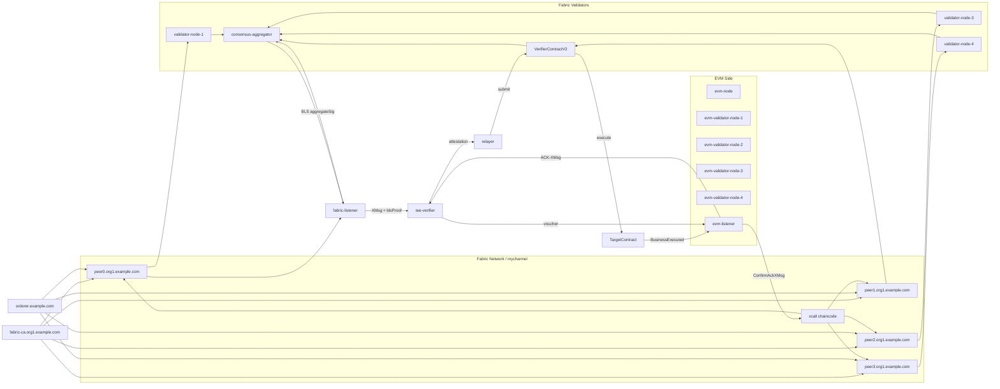

# Cross-Chain Trusted Transport Prototype

## 项目概述

本项目实现了一个面向跨链智能合约调用的可信数据传输原型。当前主线实验场景为：

- 源链：本地 Hyperledger Fabric 网络（4 peer + 1 orderer）
- 目标链：本地 Hardhat EVM 测试链
- 链下可信组件：TEE 模拟验证服务 + BLS12-381 阈值签名聚合
- 源链侧验证层：基于 4 个真实 Fabric peer 的验证节点集合
- EVM 侧验证层：基于 4 个 EVM 验证节点的集合
- 信任模型：BLS 聚合签名 + TEE 双重约束（VerifierContractV2 链上独立验证）

系统目标是将源链事件转换为统一跨链消息 `XMsg`，结合事件包含证明、最终性信息、BLS 阈值签名证明和 TEE 背书，在目标链上完成可信验证与业务执行，并支持 ACK 回执闭环。

## 当前架构

### Fabric 侧组件

- `fabric-ca.org1.example.com`
  - Fabric CA 证书服务
- `orderer.example.com`
  - 排序节点
- `peer0.org1.example.com`
- `peer1.org1.example.com`
- `peer2.org1.example.com`
- `peer3.org1.example.com`
  - 4 个 Fabric peer，均加入 `mychannel`
- `validator-node-1`
- `validator-node-2`
- `validator-node-3`
- `validator-node-4`
  - 4 个与 peer 一一绑定的 Fabric 验证节点，支持 ECDSA 签名和 BLS 签名双模式
- `consensus-aggregator`
  - 聚合 4 个验证节点的签名，生成阈值证明，支持 ECDSA 阈值签名和 BLS 聚合签名两种方案
- `fabric-listener`
  - 监听 Fabric 链码事件，调用 proof-builder 构造 `XMsg`，向 consensus-aggregator 请求 BLS 聚合证明
- `fabric-tools`
  - Fabric 命令行工具容器，用于链码调用和管理操作

### EVM 侧组件

- `evm-node`
  - 本地 Hardhat 测试链（Chain ID 31337）
- `evm-validator-node-1`
- `evm-validator-node-2`
- `evm-validator-node-3`
- `evm-validator-node-4`
  - 4 个 EVM 验证节点，在签名前从 EVM 节点获取交易回执进行验证
- `evm-listener`
  - 监听 EVM 合约事件，支持 forward 模式（监听 EvmSourceContract.FabricCallRequested）和 ack 模式（监听 TargetContract.BusinessExecuted）

### 合约层

- `EvmSourceContract.sol`
  - EVM 源链合约，发出 `FabricCallRequested` 事件
- `TargetContract.sol`
  - 目标链业务合约，解析并执行跨链业务负载，发出 `BusinessExecuted` 事件
- `VerifierContract.sol`（V1）
  - 目标链验证合约 V1，采用 ECDSA 阈值签名 + TEE 单约束模型
- `VerifierContractV2.sol`（V2）
  - 目标链验证合约 V2，采用 BLS 聚合签名 + TEE 双重约束模型
  - 验证者集合链上锚定（`registerValidatorSet` / `deactivateValidatorSet`）
  - TEE 身份链上白名单管理（`registerTEE` / `removeTEE`）
  - 每次验证需满足：TEE 签名有效 + TEE 在白名单中 + 验证者集合在链上活跃

### 链下可信层

- `tee-verifier/server.js`
  - 模拟 TEE 验证服务，提供两个核心端点：
  - `/attest` — 混合桥路径：验证 eventProof、finalityInfo、BLS 聚合签名，输出 TEE 背书
  - `/verify-sign` — 兼容路径：验证 ECDSA 签名，输出 TEE 背书

### 验证节点与 peer 的绑定关系

- `validator-node-1 -> peer0.org1.example.com`
- `validator-node-2 -> peer1.org1.example.com`
- `validator-node-3 -> peer2.org1.example.com`
- `validator-node-4 -> peer3.org1.example.com`

每个 Fabric 验证节点在签名前，会通过自己绑定的 Fabric peer 查询 `GetBlockByTxID`，确认源链交易确实存在且已被提交到区块中。



## 目录说明

- `contracts/`
  - 目标链 Solidity 合约（EvmSourceContract、TargetContract、VerifierContract V1、VerifierContractV2 V2）
- `fabric-chaincode/xcall/`
  - Fabric 链码，负责发出 `XCALL` 事件、处理入站 XMsg（`ExecuteInboundXMsg`）以及处理 ACK 回执（`ConfirmAckXMsg`）
- `fabric-network/`
  - Fabric 网络配置（crypto-config）、连接配置文件（本地/容器内）、初始化脚本（bootstrap/create-channel/deploy-chaincode/invoke-xcall）
- `source-chain/`
  - `fabric-listener.js` — Fabric 源链事件监听器
  - `evm-listener.js` — EVM 源链事件监听器（forward/ack 双模式）
  - `fabric-sim.js` — Fabric 模拟源链（用于快速实验，不依赖真实 Fabric 网络）
- `proof-builder/`
  - `fabric-proof-builder.js` — 从 Fabric 事件构造 XMsg
  - `evm-proof-builder.js` — 从 EVM 事件构造 XMsg
  - `merkle.js` — Merkle 树的构建与验证
- `consensus-aggregator/`
  - `server.js` — 聚合器 Express 服务（`/aggregate` ECDSA + `/bls-aggregate` BLS）
  - `client.js` — 聚合器 HTTP 客户端
  - `index.js` — 共识聚合核心逻辑（`buildConsensusAggregate` / `buildBlsConsensusAggregate`）
  - `validator-set.js` — 验证者集合定义（Fabric mychannel + EVM localhost 两组）
- `validator-node/`
  - Fabric peer-backed 验证节点服务（`/sign` ECDSA + `/bls-sign` BLS）
- `evm-validator-node/`
  - EVM 验证节点服务（`/sign` ECDSA + `/bls-sign` BLS）
- `tee-verifier/`
  - TEE 模拟验证服务（`/attest` 混合桥 + `/verify-sign` 兼容路径）
- `relayer/`
  - `index.js` — Fabric → EVM 正向中继器
  - `evm-to-fabric.js` — EVM → Fabric 反向中继器
  - `ack-to-fabric.js` — ACK-XMsg → Fabric 回执中继器
- `shared/`
  - `bls.js` — BLS12-381 密钥派生、签名、聚合、验证
  - `consensus-proof.js` — ECDSA 共识证明的构造与验证
  - `fabric-proof.js` — Fabric 事件证明与最终性信息的构造与验证
  - `evm-proof.js` — EVM 事件证明与最终性信息的构造与验证
  - `xmsg.js` — 业务负载标准化与 ABI 编码
  - `utils.js` — 文件读写、哈希等工具函数
- `scripts/`
  - `deploy.js` — EVM 合约部署脚本
  - `test-hybrid-bridge.js` — BLS 加密 + TEE 认证组件级测试（21 个测试点）
  - `run-fabric-e2e-tests.js` — 正向 E2E 测试套件（8 个用例，Fabric → EVM）
  - `run-full-suite.js` — 闭环 E2E 测试套件（8 个用例，Fabric → EVM → Fabric ACK）
  - `run-fabric-test-case.js` — 单条 Fabric 用例调用
  - `run-experiment.js` — 模拟实验运行器（支持 normal/tamper/replay/forged/rollback 模式）
  - `run-evm-fabric-demo.js` — EVM → Fabric 演示脚本
  - `docker-ack-relay.js` — Docker 容器内 ACK 回传脚本
  - `export-fabric-wallet.js` — Fabric 钱包导出
  - `generate-test-datasets.js` — 测试数据集生成
  - `load-test-case.js` — 测试用例加载器
  - `request-evm-fabric-call.js` — EVM 源链合约调用
- `test-data/`
  - `fabric-real-cases.json` — 8 条真实 Fabric E2E 用例
  - `functional-cases.json` — 12 条功能正确性用例
  - `security-cases.json` — 8 条安全攻击实验用例
  - `performance-cases.json` — 12 条性能实验用例（256B~32KB）
- `runtime/`
  - 运行时生成文件：部署地址、TEE 状态、最新 XMsg、测试结果、监听到的事件
- `docs/`
  - `hybrid-bridge-design.md` — BLS + TEE 混合桥设计文档

## XMsg 处理流程

### 正向链路（Fabric → EVM 混合桥路径）

1. Fabric 链码 `xcall` 的 `EmitXCall` 发出 `XCALL` 事件，携带业务负载 JSON。
2. `fabric-listener` 通过 Fabric Gateway 监听合约事件，捕获 `txId`、`blockNumber`、业务负载。
3. `proof-builder` 标准化业务字段（op/recordId/actor/amount/metadata/requireAck），ABI 编码为 `(string,string,string,string,string,bool)`，计算 `payloadHash`，构造 Merkle 事件证明。
4. `consensus-aggregator` 的 `/bls-aggregate` 端点向 4 个 validator 节点发起 BLS 签名请求。
5. 每个 validator 节点通过自己绑定的 peer 查询 `GetBlockByTxID` 确认交易存在，使用 BLS 私钥对共识消息签名。
6. 聚合器收集到达到阈值（3/4）的 BLS 签名后，通过 `blsAggregateSignatures` 聚合成单一 48 字节 `aggregateSig`。
7. `tee-verifier` 的 `/attest` 端点：
   - 验证 `eventProof`（requestID、payloadHash、blockNumber、Merkle 证明）
   - 验证 `finalityInfo`（blockHash、commitStatus）
   - 调用 `blsVerifyAggregate` 一次性验证 BLS 聚合签名（O(1) 配对操作）
   - 所有校验通过后，对 `attestDigest = keccak256(reportHash, teePubKey)` 签名，输出 TEE 背书
8. `relayer` 将 `XMsg + reportHash + teeSig + teePubKey + validatorSetId` 提交到 `VerifierContractV2.submit()`。
9. `VerifierContractV2` 验证：TEE 在白名单中 + TEE 签名有效 + 验证者集合活跃 → 调用 `TargetContract.execute()`。
10. `TargetContract` 解码 ABI 负载，存储执行记录，发出 `BusinessExecuted` 事件。

### 反向链路（EVM → Fabric）

1. 调用 `EvmSourceContract.requestFabricCall(payloadJson)` 发出 `FabricCallRequested` 事件。
2. `evm-listener --mode forward` 捕获事件，构造 `latest-evm-xmsg.json`。
3. `relayer/evm-to-fabric.js` 通过 TEE `/verify-sign` 获取背书，提交到 Fabric 链码 `ExecuteInboundXMsg`。

### ACK 闭环链路（Fabric → EVM → Fabric ACK）

1. 正向链路完成后，`TargetContract` 发出 `BusinessExecuted` 事件。
2. 若 `requireAck = true`，`evm-listener --mode ack` 捕获事件，构造 ACK 型 `XMsg`。
3. `relayer/ack-to-fabric.js`（或 Docker 内的 `docker-ack-relay.js`）将 ACK 回传 Fabric。
4. Fabric 链码 `ConfirmAckXMsg` 记录回执状态，可通过 `GetAckStatus(originRequestID)` 查询。

## 混合桥信任模型

当前版本实现了 BLS + TEE 混合桥设计（详见 `docs/hybrid-bridge-design.md`），核心思想是将验证职责分散为两个独立维度：

- **维度一：BLS 聚合签名**
  - 使用 BLS12-381 曲线的 shortSignatures 模式（G1 签名 48 字节，G2 公钥 96 字节）
  - 4 个验证者中任意 3 个的签名聚合成单一聚合签名
  - 链下 TEE 通过 `blsVerifyAggregate` 一次性验证（O(1) 配对操作）
  - 验证者公钥集合通过 `registerValidatorSet()` 链上锚定

- **维度二：TEE 身份验证**
  - TEE 对 `attestDigest = keccak256(abi.encode(reportHash, teePubKey))` 进行 ECDSA 签名
  - 链上 `VerifierContractV2` 恢复签名者并验证 TEE 白名单状态
  - attestDigest 不含时间戳，确保合约可独立重新计算并验证

- **双重约束**
  - `VerifierContractV2.submit()` 同时检查：
    1. TEE 签名有效 → TEE 确认了证明结构
    2. TEE 公钥在白名单中 → TEE 身份可信
    3. 验证者集合在链上处于活跃状态 → 源链验证层未被篡改

相比 V1（仅验证 TEE 签名，TEE 成为单点信任），V2 将信任分散到 BLS 聚合签名和 TEE 两方，任何单方被攻破均无法通过合约验证。

## 运行要求

- Windows 10/11 + PowerShell
- Docker Desktop（已启用 Linux 容器）
- Node.js 20+（本地已安装 npm）
- 空闲端口：7050-7054、8051-8052、9051-9052、10051-10052、9101-9104、9200、9301-9304、9000、8545

## 快速开始

### 一键启动（推荐）

```powershell
.\start.ps1                    # 完整闭环测试 (Fabric → EVM → Fabric ACK)
.\start.ps1 -TestMode forward  # 仅正向测试 (Fabric → EVM)
.\start.ps1 -SkipSetup         # 跳过初始化，直接测试（已搭建过时使用）
```

等价 npm 命令：

```powershell
npm.cmd run start              # 完整闭环
npm.cmd run start:forward      # 仅正向
```

脚本分 8 个阶段自动完成：Fabric 网络初始化（首次）→ 启动全部容器 → 等待服务就绪 → 创建通道/部署链码（首次）→ 部署 EVM 合约 → 启动监听器 → 重启聚合器 → 运行测试。

### 手动分步启动（首次初始化）

建议按下面顺序执行：

```powershell
npm install
powershell -ExecutionPolicy Bypass -File fabric-network\scripts\bootstrap.ps1
npm.cmd run fabric:wallet
npm.cmd run fabric:up
npm.cmd run fabric:channel
npm.cmd run fabric:cc:deploy
docker compose -f docker-compose.fabric.yml up -d fabric-listener
docker compose up -d evm-node
docker compose up -d tee-verifier
npm.cmd run deploy
docker compose -f docker-compose.fabric.yml restart fabric-listener
npm.cmd run fabric:test
```

如果 Fabric 网络已经初始化过，日常启动可以直接使用一键脚本：

```powershell
.\start.ps1
```

如果你是在 `cmd` 中运行，请用：

```cmd
powershell -ExecutionPolicy Bypass -File .\start.ps1
```

## 真实 Fabric 测试

### 正向测试（Fabric → EVM）

运行整套 8 条用例的正向跨链测试：

```powershell
npm.cmd run fabric:test
```

或直接：

```powershell
node scripts/run-fabric-e2e-tests.js
```

### 闭环测试（Fabric → EVM → Fabric ACK）

运行整套 8 条用例的完整闭环测试：

```powershell
npm.cmd run fabric:test:ack
```

或直接：

```powershell
node scripts/run-full-suite.js
```

### 单条用例测试

```powershell
node scripts/run-fabric-test-case.js test-data/fabric-real-cases.json FABRIC-001
```

### 组件级测试

```powershell
npm.cmd run test:hybrid
```

运行 BLS 密钥派生、签名/验签、聚合签名、阈值灵活性、共识聚合器流程、TEE /attest 响应结构和签名验证等 21 个测试点。

### 测试结果文件

正向测试输出到：
- `runtime/fabric-hybrid-e2e-results.json`

闭环测试输出到：
- `runtime/fabric-full-roundtrip-results.json`

## 当前真实 Fabric 测试集

当前 `test-data/fabric-real-cases.json` 包含 8 条真实 Fabric 用例：

- `FABRIC-001` 资产锁定 — `asset_lock / FABRIC-ASSET-0001 / org1.userA / 128.50`
- `FABRIC-002` 铸造确认 — `mint_confirm / FABRIC-ESCROW-0002 / 0xAb58...aec9B / 980.00`
- `FABRIC-003` 应收账款确认 — `receivable_attest / FABRIC-AR-889102 / med-device-supplier / 285000.00`
- `FABRIC-004` 物流同步 — `logistics_sync / FABRIC-WB-20260326-04 / iot-gateway-07 / -18.6`
- `FABRIC-005` 医疗授权 — `medical_consent / FABRIC-CONSENT-0005 / hospital-b-chain / 30`
- `FABRIC-006` 预言机更新 — `oracle_update / CNY_USD_REFERENCE / state-fx-lab / 0.1387`
- `FABRIC-007` 多方审批 — `approval_commit / WF-FABRIC-APR-7007 / bank-a,bank-b,notary-c / 2`
- `FABRIC-008` 补贴确认 — `subsidy_confirm / FABRIC-SUB-AGRI-0008 / cooperative-jiangsu-01 / 46250.00`

每条用例包含 `payload`（实际发送的业务 JSON）、`expectedMode: "fabric-real"`、`expectedTargetFields`（链上预期字段值）。

此外 `test-data/` 目录还包含：
- `functional-cases.json` — 12 条功能正确性用例（FUNC-001 ~ FUNC-012）
- `security-cases.json` — 8 条安全攻击实验用例（SEC-001 ~ SEC-008，覆盖篡改/重放/伪造/回滚）
- `performance-cases.json` — 12 条性能实验用例（PERF-001 ~ PERF-012，覆盖 256B~32KB 负载）

## 一键启动脚本说明

`start.ps1` 支持以下参数：

| 参数 | 说明 |
|------|------|
| `-TestMode forward` | 仅正向 Fabric → EVM 测试 |
| `-TestMode full` | 完整闭环 Fabric → EVM → Fabric ACK 测试（默认） |
| `-SkipSetup` | 跳过初始化步骤（已搭建过 Fabric 网络时使用，节省时间） |

脚本分 8 个阶段自动完成：

1. **Phase 1 — 首次初始化**：`npm install`、Fabric 加密材料生成（`bootstrap.ps1`）、钱包身份导出、Solidity 合约编译（首次）
2. **Phase 2 — 启动容器**：启动 Fabric 容器（CA、orderer、4 peer、4 Fabric 验证者、聚合器、fabric-tools）+ EVM 容器（evm-node、4 EVM 验证者）+ TEE 验证者（Docker 内）
3. **Phase 3 — 等待就绪**：逐个等待 peer 节点启动、验证节点就绪、聚合器启动、EVM RPC 可访问、TEE 端点可访问
4. **Phase 4 — 通道与链码**：创建 Fabric 通道 `mychannel`（`create-channel.ps1`）、部署 `xcall` 链码（`deploy-chaincode.ps1`）（首次）
5. **Phase 5 — EVM 合约**：编译并部署 VerifierContract、VerifierContractV2、TargetContract、EvmSourceContract
6. **Phase 6 — 监听器**：启动 `fabric-listener` 容器，等待监听就绪（`Listening Fabric events on mychannel/xcall:XCALL`）
7. **Phase 7 — 聚合器**：重启 `consensus-aggregator` 使其重新连接 EVM 验证节点
8. **Phase 8 — 测试**：根据 `-TestMode` 运行对应测试套件并打印结果路径

## 安全边界说明

当前方案已经实现：

- 基于真实 Fabric 事件的 `XMsg` 构造（监听器从 Fabric Gateway 获取真实合约事件）
- BLS12-381 聚合签名（4 个 peer-backed validator，阈值 3/4，O(1) 配对验证）
- 每个 Fabric 验证节点通过查询 Fabric peer 的 `GetBlockByTxID` 确认交易存在后再签名
- 事件 Merkle 证明 + 区块最终性信息 + BLS 聚合证明 + TEE 背书的四层组合验证
- TEE 链下证明结构验证 + 链上 TEE 身份验证的双重约束模型
- 验证者集合链上锚定（`registerValidatorSet` / `deactivateValidatorSet`），支持动态管理
- 反重放保护（`VerifierContractV2.consumed` mapping）
- 负载完整性校验（`keccak256(payload) == payloadHash`）

但仍需注意：

- `tee-verifier` 目前仍是软件模拟的 TEE，不是硬件级 SGX/TDX/SEV 可信执行环境
- 4 个 peer 和 4 个验证节点目前仍运行在同一本地 Docker 实验环境中，未做物理隔离
- 当前 Fabric 网络仍是单组织 `Org1` 的多 peer 实验网络，不是多组织生产部署
- TEE 模拟服务的私钥存储在 `runtime/tee-state.json` 中，生产环境应由硬件 TEE 保护

因此，这一版本更适合表述为：

> 一个支持真实 Fabric 事件、BLS12-381 聚合签名、TEE 双重约束验证和目标链可信执行，并支持 ACK 闭环回执的研究原型系统。

## 常用命令

```powershell
npm.cmd run compile                        # 编译 Solidity 合约
npm.cmd run deploy                         # 部署 EVM 合约
npm.cmd run fabric:wallet                  # 导出 Fabric 钱包身份
npm.cmd run fabric:up                      # 启动 Fabric 容器
npm.cmd run fabric:channel                 # 创建 Fabric 通道
npm.cmd run fabric:cc:deploy               # 部署 Fabric 链码
npm.cmd run fabric:test                    # 运行正向测试
npm.cmd run fabric:test:ack                # 运行闭环测试
npm.cmd run test:hybrid                    # 运行组件级测试
.\start.ps1                                # 一键启动（完整闭环）
.\start.ps1 -TestMode forward              # 一键启动（仅正向）
.\start.ps1 -SkipSetup                     # 一键启动（跳过初始化）
docker compose -f docker-compose.fabric.yml up -d fabric-listener
docker compose -f docker-compose.fabric.yml down -v
docker compose up -d evm-node
docker compose up -d tee-verifier
docker compose up -d evm-validator-node-1 evm-validator-node-2 evm-validator-node-3 evm-validator-node-4
```

## 双向联调

当前版本已经支持三条链路联调：

- `Fabric -> EVM`（正向）
- `EVM -> Fabric`（反向）
- `ACK-XMsg -> Fabric`（闭环回执）

其中：

- 正向 `Fabric -> EVM` 走混合桥路径：`fabric-listener -> BLS 聚合共识 -> TEE /attest -> VerifierContractV2 -> TargetContract`
- 反向 `EVM -> Fabric` 走：`evm-listener (forward) -> evm validator set -> TEE /verify-sign -> Fabric chaincode ExecuteInboundXMsg`
- 回执 `ACK-XMsg -> Fabric` 走：`TargetContract.BusinessExecuted -> evm-listener (ack) -> ACK-XMsg -> TEE /verify-sign -> Fabric chaincode ConfirmAckXMsg`

### 联调前置

先完成基础启动：

```powershell
.\start.ps1 -SkipSetup
# 或手动：
docker compose up -d evm-node evm-validator-node-1 evm-validator-node-2 evm-validator-node-3 evm-validator-node-4 tee-verifier
npm.cmd run deploy
docker compose -f docker-compose.fabric.yml restart fabric-listener
```

再启动两个 EVM 监听器：

```powershell
node source-chain/evm-listener.js --mode forward
```

```powershell
node source-chain/evm-listener.js --mode ack
```

等价脚本命令：

```powershell
npm.cmd run evm:listen
npm.cmd run evm:listen:ack
```

### 1. 运行 EVM -> Fabric

```powershell
npm.cmd run evm:fabric:demo
```

这一步会自动完成：

- 调用 `EvmSourceContract.requestFabricCall(...)` 发出 `FabricCallRequested` 事件
- `evm-listener --mode forward` 捕获事件并生成 `latest-evm-xmsg.json`
- 由 EVM 侧 4 个验证节点生成 BLS 聚合签名证明
- 经 TEE `/attest` 验证后，由 `relayer/evm-to-fabric.js` 提交到 Fabric 链码 `ExecuteInboundXMsg`

结果文件：

- `runtime/latest-evm-xmsg.json`
- `runtime/last-evm-to-fabric-result.json`

### 2. 运行 Fabric -> EVM

单条样例：

```powershell
node scripts/run-fabric-test-case.js test-data/fabric-real-cases.json FABRIC-001
node relayer/index.js normal
```

全量样例（8 条正向）：

```powershell
npm.cmd run fabric:test
```

结果文件：

- `runtime/latest-xmsg.json`
- `runtime/last-relay-result.json`
- `runtime/fabric-hybrid-e2e-results.json`

### 3. 运行 ACK-XMsg -> Fabric

当 `Fabric -> EVM` 成功且 `requireAck = true` 时，`evm-listener --mode ack` 会自动监听 `TargetContract.BusinessExecuted` 事件，并生成：

- `runtime/evm-ack-captured-event.json`
- `runtime/latest-ack-xmsg.json`

然后通过 Docker 内部中继器执行回传：

```powershell
docker exec fabric-listener node /app/scripts/docker-ack-relay.js
```

这一步会：

- 将回执型 `XMsg` 发给 TEE `/verify-sign` 获取背书
- 通过 Fabric Gateway 提交到链码 `ConfirmAckXMsg`
- Fabric 链码记录原始请求的回执状态

结果文件：

- `runtime/latest-ack-xmsg.json`
- `runtime/last-ack-to-fabric-result.json`

### 4. 查看 Fabric 侧闭环状态

当前 Fabric 链码已支持以下查询：

- `GetInboundStatus(requestID)` — 查看 EVM → Fabric 入站请求是否已执行
- `GetAckStatus(originRequestID)` — 查看 Fabric → EVM 原始请求是否已收到成功回执

### 全套闭环测试（全自动 8 用例）

```powershell
npm.cmd run fabric:test:ack
```

全量闭环测试结果文件：

- `runtime/fabric-full-roundtrip-results.json`

### 最近一次双向联调结果

最近一次实际联调已跑通全部 8 条闭环用例：

- `Fabric -> EVM`（正向）：8/8 全部成功，proofType: hybrid-v1（bls-aggregate），阈值 3/4
  - 结果见 `runtime/fabric-hybrid-e2e-results.json`
- `EVM -> Fabric -> ACK`（闭环）：8/8 全部成功，每条 ACK 均返回 `{"ok":true,"status":"success"}`
  - 结果见 `runtime/fabric-full-roundtrip-results.json`

典型闭环数据：

| 用例 | 正向 Gas | ACK 状态 | 总耗时 |
|------|----------|----------|--------|
| FABRIC-001 asset_lock | 540,879 | confirmed | ~15s |
| FABRIC-002 mint_confirm | 631,279 | confirmed | ~15s |
| FABRIC-003 receivable_attest | 542,044 | confirmed | ~15s |
| FABRIC-004 logistics_sync | 541,162 | confirmed | ~15s |
| FABRIC-005 medical_consent | 541,509 | confirmed | ~15s |
| FABRIC-006 oracle_update | 541,126 | confirmed | ~15s |
| FABRIC-007 approval_commit | 540,759 | confirmed | ~24s |
| FABRIC-008 subsidy_confirm | 541,450 | confirmed | ~24s |

## ACK Optional Mode

The current version supports optional acknowledgements.

- When `requireAck = false`:
  - the system runs only the forward `Fabric -> EVM` path
  - no `ACK-XMsg` is generated after target-chain execution
  - this is suitable for calls that do not require source-chain confirmation

- When `requireAck = true`:
  - the system runs the full closed loop
  - the target chain emits `BusinessExecuted` and builds an `ACK-XMsg`
  - the ACK then goes through proof generation, BLS threshold signatures, TEE endorsement, and is written back to Fabric via `ConfirmAckXMsg`
  - the source chain can verify receipt via `GetAckStatus(originRequestID)`

`requireAck` is an explicit field in the business payload JSON and participates in ABI payload encoding as the 6th field `(string,string,string,string,string,bool)`.

## Test Modes

Two test modes are kept side by side.

- Forward-only baseline
  - command:
    ```powershell
    npm.cmd run fabric:test
    ```
  - output:
    - `runtime/fabric-hybrid-e2e-results.json`

- Full closed loop with ACK
  - command:
    ```powershell
    npm.cmd run fabric:test:ack
    ```
  - output:
    - `runtime/fabric-full-roundtrip-results.json`

## Automatic Startup Script

`start.ps1` supports both modes.

- Full closed loop (default):
  ```powershell
  .\start.ps1
  ```
  or:
  ```powershell
  .\start.ps1 -TestMode full
  ```

- Forward-only:
  ```powershell
  .\start.ps1 -TestMode forward
  ```

- Skip first-time setup (subsequent runs):
  ```powershell
  .\start.ps1 -SkipSetup
  ```

The script prints the corresponding result files after completion.
